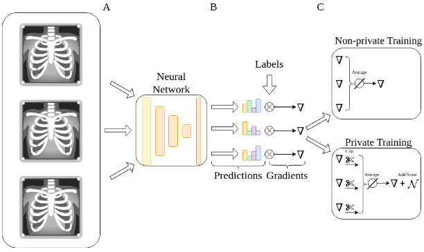

# Preserving fairness and diagnostic accuracy in private large-scale AI models for medical imaging


Overview
------

* This is the official repository of the paper [**Preserving fairness and diagnostic accuracy in private large-scale AI models for medical imaging**](https://doi.org/10.1038/s43856-024-00462-6).
* Pre-print version: [https://arxiv.org/abs/2302.01622](https://arxiv.org/abs/2302.01622)


Introduction
------
Differentially-private training of advanced artificial intelligence models for diagnosis of chest radiographs with privacy-preserving techniques yields results with negligible performance and fairness trade-offs on large real-world datasets.





### Prerequisites

The software is developed in **Python 3.10**. For deep learning, the **PyTorch 1.13** framework is used. The DP code was developed using **Opacus 1.3.0**.


Main Python modules required for the software can be installed from ./requirements in three stages:

1. Create a Python3 environment by installing the conda `environment.yml` file:

```
$ conda env create -f environment.yaml
$ source activate DP_CXR
```


2. Install the remaining dependencies from `requirements.txt`.


**Note:** These might take a few minutes.


Code structure
---

Our source code for differential privacy as well as training and evaluation of the deep neural networks, image analysis and preprocessing, and data augmentation are available here.

1. Everything can be run from *./main_2D_DP.py*. 
* The data preprocessing parameters, directories, hyper-parameters, and model parameters can be modified from *./configs/config.yaml*.
* Also, you should first choose an `experiment` name (if you are starting a new experiment) for training, in which all the evaluation and loss value statistics, tensorboard events, and model & checkpoints will be stored. Furthermore, a `config.yaml` file will be created for each experiment storing all the information needed.
* For testing, just load the experiment which its model you need.

2. The rest of the files:
* *./data/* directory contains all the data preprocessing, augmentation, and loading files.
* *./Train_Valid_DP.py* contains the training and validation processes.
* *./Prediction_DP.py* all the prediction and testing processes.


Citation
---

### In case you use this repository, please cite the original paper:

S. Tayebi Arasteh, A. Ziller, C. Kuhl, M. Makowski, S. Nebelung, R. Braren, D. Rueckert, D. Truhn, G. Kaissis. "*Preserving fairness and diagnostic accuracy in private large-scale AI models for medical imaging*". Commun Med 4 (2024), https://doi.org/10.1038/s43856-024-00462-6.


### BibTex

    @article {DPCXR2024,
      author = {Tayebi Arasteh, Soroosh and Ziller, Alexander and Kuhl, Christiane and Makowski, Marcus and Nebelung, Sven and Braren, Rickmer and Rueckert, Daniel and Truhn, Daniel and Kaissis, Georgios},
      title = {Preserving fairness and diagnostic accuracy in private large-scale AI models for medical imaging},
      year = {2024},
      volume = {4},
      doi = {10.1038/s43856-024-00462-6},
      publisher = {Nature Portfolio},
      URL = {https://doi.org/10.1038/s43856-024-00462-6},
      journal = {Communications Medicine}
    }

